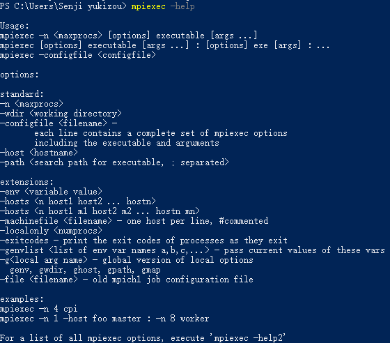
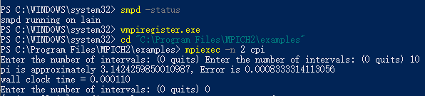
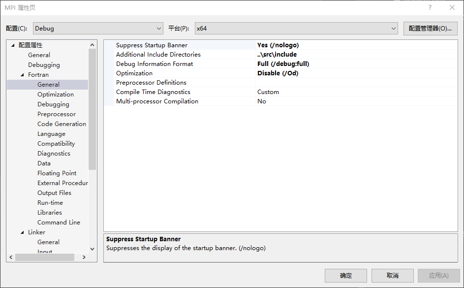
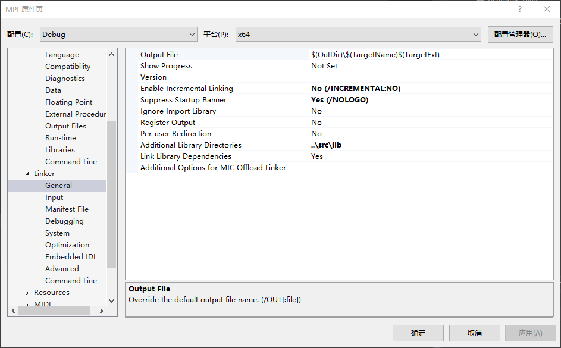
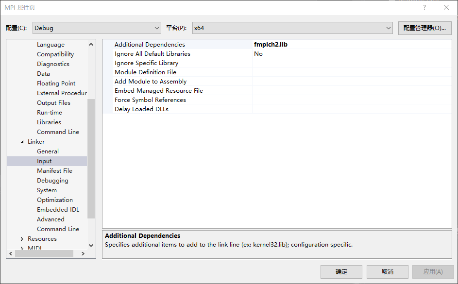
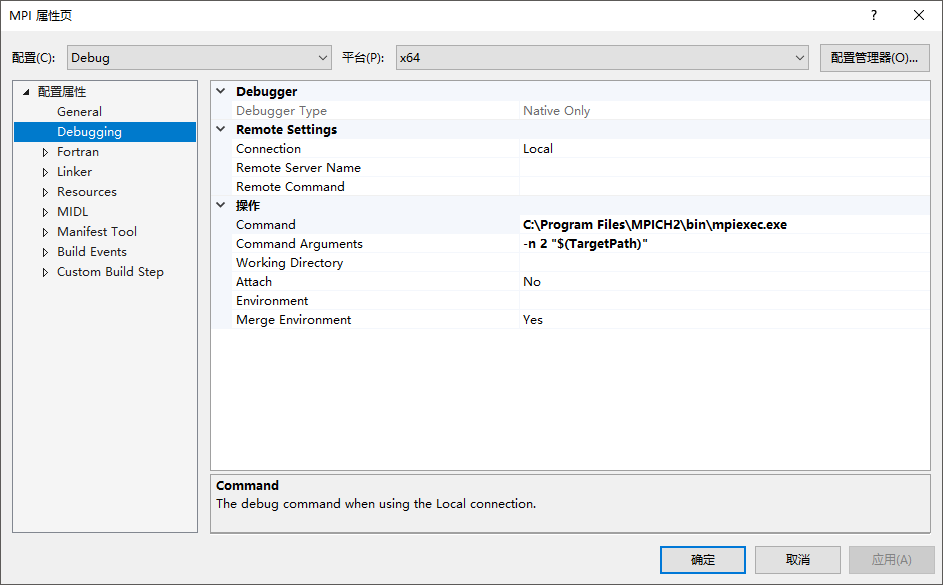
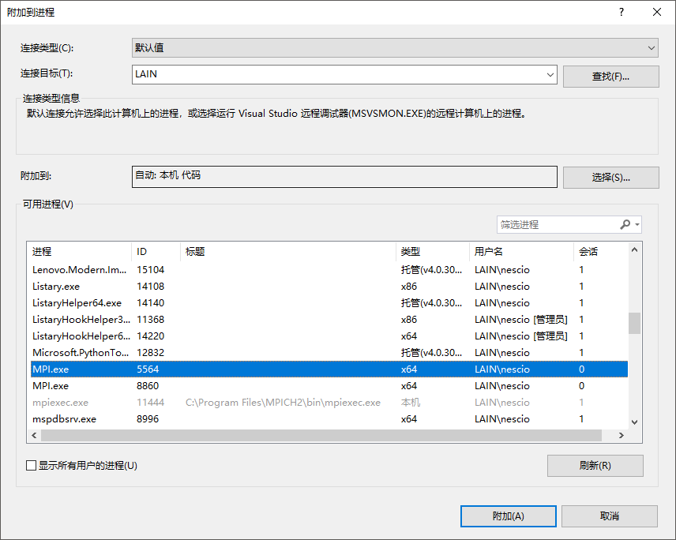
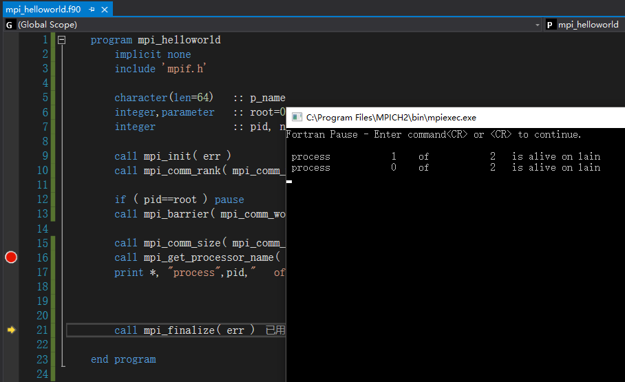

# 在Windows上安装使用MPICH2

MPICH已经放弃Windows，其官网上最新的Windows release是2011年9月的[mpich2-1.4.1p1](https://www.mpich.org/static/downloads/1.4.1p1/)
细心的您可能已经在MPICH官网上看到Microsoft接了这个坑，但其MS-MPI竟然基于`MPICH1.0.3`！:confused:

:expressionless:这里只介绍MPICH2的安装测试以及Fortran并行的调试。


在Windows上安装MPICH2：

1. Windows10用户请确认系统已经启用`.NET Framework 2.0&3.5`；
2. Ansys，Virtual Lab.等软件会自动为用户安装MPI。请在命令行窗口键入`mpiexec -V`以确认当前系统MS-MPI或mpirt的安装状态。
   若已安装请卸载相应的软件并移除对应的环境变量。找不到安装路径时请使用`where mpiexec`；
3. 下载安装[mpich2-1.4.1p1](https://www.mpich.org/static/downloads/1.4.1p1/)，假设安装路径是`C:\Program Files\MPICH2\`；
4. 将路径`C:\Program Files\MPICH2\bin`加入环境变量。确认smpd服务的运行状态，若smpd未在运行请尝试使用`smpd -install -phrase behappy`；
5. 运行`C:\Program Files\MPICH2\bin`目录下的`wmpiregister.exe`注册；
6. 这时若在命令行键入`mpiexec -help`应当会得到如图信息：
   
7. 并行运行`C:\Program Files\MPICH2\examples`目录下的`cpi.exe`，如'`mpiexec -n 4 cpi`'
   


编译Fortran MPI并行程序：

8. 使用Visual Studio创建解决方案。
9. 并行Hello World程序如下：
    
    ```Fortran
    program mpi_helloworld
        implicit none
        include 'mpif.h'
    
        character(len=64)   :: p_name
        integer,parameter   :: root=0
        integer             :: pid, num_p, p_namelen, err
    
        call mpi_init( err )
        call mpi_comm_rank( mpi_comm_world,pid,err )
    
        call mpi_comm_size( mpi_comm_world,num_p,err )
        call mpi_get_processor_name( p_name,p_namelen,err )
        print*, "process",pid,"   of",num_p,"  is alive on",p_name(1:p_namelen)
    
        call mpi_finalize( err )
    
    end program
    ```
    
10. 将MPICH2安装目录`C:\Program Files\MPICH2\lib`中的`fmpich2.lib`拷贝到`\your\SolutionFile\dir\lib`;
11. 将MPICH2安装目录`C:\Program Files\MPICH2\include`中的`mpif.h`拷贝到`\your\SolutionFile\dir\include`;
12. 配置项目属性如图：
       
       
       
13. 编译成功


调试Fortran的MPI并行程序：

14. 在Hello World的第11行加入以下代码，目的是在不死锁的情况下使程序暂停以便于调试
    
    ```Fortran
    !For Debug
    if ( pid==root ) pause
    call mpi_barrier( mpi_comm_world,err )
    
    ```
    
15. 配置项目属性如图：
       
16. 以Debug模式运行程序，待到命令行输出`Fortran Pause - Enter command<CR> or <CR> to continue.`
17. 激活Visual Studio窗口`Ctrl+Alt+P`附加到当前待调试进程
       
18. 设置断点，鼠标点击激活调试CMD窗口并按回车继续运行程序
       
